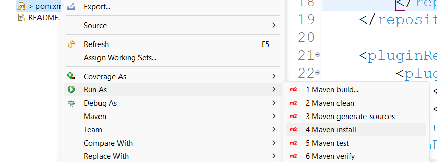
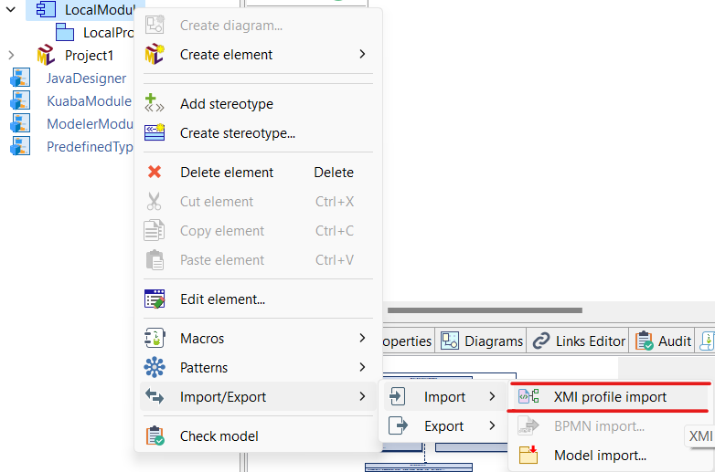

# DDD-Transform

## Overview
In this project, the transformation between models is carried out through mappings between metamodels of different languages. The goal is to automatically generate Java code from a model created within the Modelio tool, which uses Domain Driven Design (DDD) stereotypes.

## Code Path
The implemented code can be found at: `src/main/java/ddd/Module/command`

## Transformation Process
In the proposed solution, mappings occur between the Platform Independent Model (PIM), using the DDD profile metamodel, and the Platform Specific Model (PSM), using the Java language metamodel. To implement these mappings, specific classes were created in the transformation module.

The main class of this module is the `TransformationCommand`, responsible for invoking the code and methods of the other classes. It has two methods: one to retrieve the selected element in Modelio and another to perform the transformations, utilizing adjacent classes that handle each case individually.

All transformations are based on the model created within the Modelio tool, using DDD stereotypes, to automatically generate Java code.

## Prerequisites
- Java 
- Modelio (version 5.4)
- DDD profile [install here](install here)
## Installation
1. Clone the repository:
   ```sh
   git clone https://github.com/Luiz-Cunha/DDD-Transform.git
   ```
2. Generate the Transformation Module:

## Usage
1. Import 'DDD profile' to use the stereotypes.

2. Import the module created in the Installation step:

3. Open Modelio and create your model using DDD stereotypes:

4. Ensure your model is correct based on DDD paradigm:

5. Run the transformation command:

6. The generated Java code will be located in the `output` directory.


## Contributing
Contributions are welcome! Please follow these steps:
1. Fork the repository.
2. Create a new branch (`git checkout -b feature/YourFeature`).
3. Commit your changes (`git commit -m 'Add some feature'`).
4. Push to the branch (`git push origin feature/YourFeature`).
5. Open a Pull Request.

## License
This project is licensed under the MIT License - see the [LICENSE](LICENSE) file for details.
